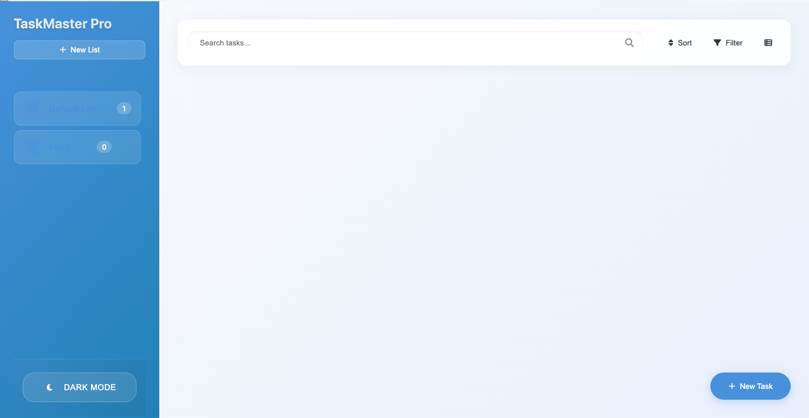

# TaskMaster Pro 📋

A modern, responsive task management application built with vanilla JavaScript, featuring a clean and intuitive interface.



## Features ✨

- **Multiple Lists**: Create and manage multiple task lists
- **Rich Task Management**:
  - Priority levels
  - Due dates
  - Time ranges
  - Tags
  - Descriptions
- **Smart Organization**:
  - Sort by various criteria
  - Filter tasks
  - Search functionality
- **Modern UI/UX**:
  - Dark/Light theme
  - Responsive design
  - Drag and drop
  - Smooth animations
- **Data Persistence**: Local storage integration
- **Mobile-First**: Fully responsive across all devices

## Technologies Used 🛠️

- HTML5
- CSS3 (with CSS Variables)
- Vanilla JavaScript (ES6+)
- Local Storage API
- Font Awesome Icons
- CSS Grid & Flexbox

## Project Structure 📁

```
to-do-App/
├── css/
│   ├── styles.css
│   └── responsive.css
├── js/
│   ├── app.js
│   ├── models/
│   │   ├── Task.js
│   │   └── TaskList.js
│   └── utils/
│       ├── UIManager.js
│       ├── StorageManager.js
│       └── DragAndDrop.js
├── index.html
└── README.md
```

## Getting Started 🚀

1. Clone the repository:

```bash
git clone https://github.com/Ocdeed/to-do-App.git
```

2. Open the project:

```bash
cd to-do-App
```

3. Serve the application:

- Using Python:
  ```bash
  python -m http.server 8000
  ```
- Using Node.js:
  ```bash
  npx serve
  ```

4. Open your browser and navigate to `http://localhost:8000`

## Usage Guide 📖

### Managing Lists

- Click "New List" to create a list
- Choose an icon and color for your list
- Delete lists using the delete button (except Default List)

### Task Operations

- Create tasks with "New Task" button
- Set priority, due date, and time range
- Add tags for better organization
- Edit or delete tasks as needed

### Organization Features

- Use the search bar to find specific tasks
- Sort tasks by title, due date, priority, or creation date
- Filter tasks by priority, due date, or status
- Toggle between grid and list views

### Theme Switching

- Click the theme toggle in the sidebar
- Automatically saves your preference

## Performance 🚄

The application is optimized for performance:

- Efficient DOM manipulation
- Debounced search
- Optimized animations
- Lazy loading of components

## Browser Support 🌐

- Chrome (latest)
- Firefox (latest)
- Safari (latest)
- Edge (latest)
- Mobile browsers

## Contributing 🤝

1. Fork the repository
2. Create your feature branch (`git checkout -b feature/AmazingFeature`)
3. Commit your changes (`git commit -m 'Add some AmazingFeature'`)
4. Push to the branch (`git push origin feature/AmazingFeature`)
5. Open a Pull Request

## Acknowledgments 🙏

- Font Awesome for the icons
- The open-source community for inspiration
- All contributors and testers

## Contact 📫

Your Name - ocdeed76@gmail.com
Project Link: https://github.com/Ocdeed/to-do-App

---

Made with by Octavian(Ocdeed)
